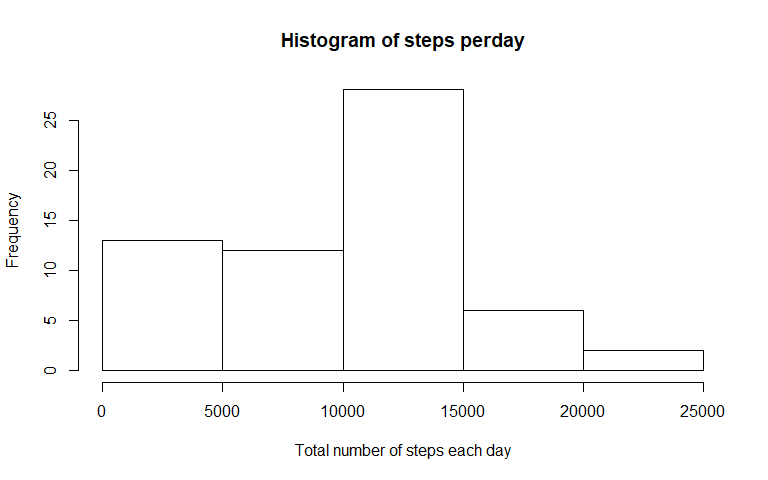
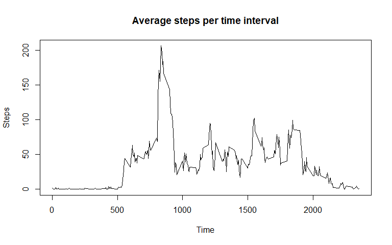
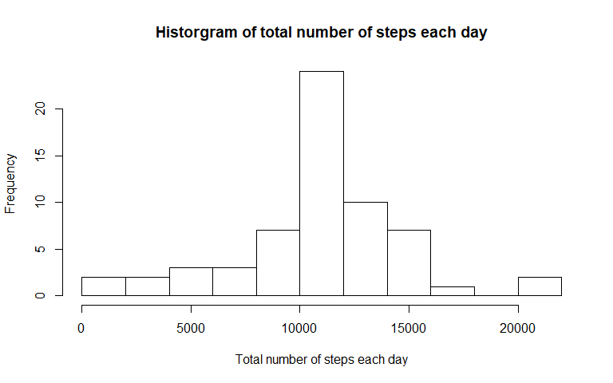
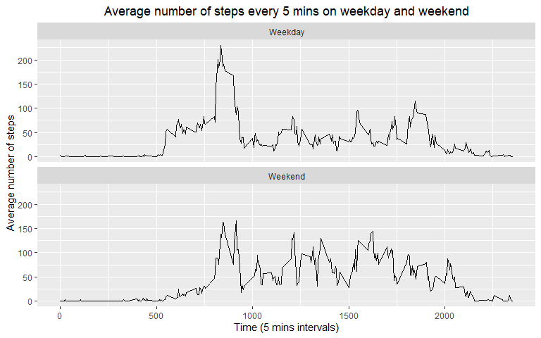

#Load and read to understand the data

Read the activity.csv document and load it into a data frame called data.


```r
data <- read.csv("activity.csv", header = TRUE)
head(data)
```

```
##   steps       date interval
## 1    NA 2012-10-01        0
## 2    NA 2012-10-01        5
## 3    NA 2012-10-01       10
## 4    NA 2012-10-01       15
## 5    NA 2012-10-01       20
## 6    NA 2012-10-01       25
```

```r
nrow(data)
```

```
## [1] 17568
```

```r
str(data)
```

```
## 'data.frame':	17568 obs. of  3 variables:
##  $ steps   : int  NA NA NA NA NA NA NA NA NA NA ...
##  $ date    : Factor w/ 61 levels "2012-10-01","2012-10-02",..: 1 1 1 1 1 1 1 1 1 1 ...
##  $ interval: int  0 5 10 15 20 25 30 35 40 45 ...
```

Load the packages that are usful to complete the questions.

```r
library(dplyr)
library(lubridate)
library(ggplot2)
library(knitr)
```


#What is mean total number of steps taken per day?

Calculating the total number of steps taken per day:


```r
total_step <- data %>%
            group_by(date)%>%
            summarise(sum_each_day = sum(steps, na.rm=TRUE))
```


Ploting a histogram of the total number of steps taken each day:


```r
hist(total_step$sum_each_day, xlab = "Total number of steps each day", main = "Histogram of steps perday")
```

<!-- -->

Calculate and report the mean and median of the total number of steps taken per day: 


```r
mean_t_step <- mean(total_step$sum_each_day, na.rm = TRUE)
median_t_step <- median(total_step$sum_each_day, na.rm = TRUE)

mean_t_step
```

```
## [1] 9354.23
```

```r
median_t_step
```

```
## [1] 10395
```
The mean of the total number of steps taken per day is 9354.2295082.

The median of the total number of steps taken per day is 10395.


#What is the average daily activity patter?

Tidying up the data to make a time series plot (arrage data into steps per interval)


```r
clean <- filter(data, !is.na(steps))
tidy <- aggregate(steps~interval, clean, mean)
```

Plotting the time series plot


```r
plot(tidy$interval, tidy$steps, type = "l", xlab = "Time", ylab = "Steps", main = "Average steps per time interval")
```

<!-- -->


Which 5-minute interval, on average across all the days in the dataset, contains the maximum number of steps?


```r
max_step <- filter(tidy, steps==max(steps))
max_step
```

```
##   interval    steps
## 1      835 206.1698
```


#Imputing missing values

Calculate and report the total number of missing values in the dataset


```r
miss <- sum(is.na(data))
miss
```

```
## [1] 2304
```

Using the mean for each day for filling the missing values in the dataset.

Filling in all missing values into a new dataset


```r
data_fill <- data %>% 
            mutate(steps = case_when(is.na(steps) ~ tidy$steps[match(
              data$interval, tidy$interval)], TRUE ~ as.numeric(steps)
            ))

head(data_fill)
```

```
##       steps       date interval
## 1 1.7169811 2012-10-01        0
## 2 0.3396226 2012-10-01        5
## 3 0.1320755 2012-10-01       10
## 4 0.1509434 2012-10-01       15
## 5 0.0754717 2012-10-01       20
## 6 2.0943396 2012-10-01       25
```

Calculate the total steps of each day for plotting the histogram.


```r
data_fill_sum <- data_fill%>%
                group_by(date)%>%
                  summarise(sum = sum(steps))
data_fill_sum
```

```
## # A tibble: 61 x 2
##    date          sum
##    <fct>       <dbl>
##  1 2012-10-01 10766.
##  2 2012-10-02   126 
##  3 2012-10-03 11352 
##  4 2012-10-04 12116 
##  5 2012-10-05 13294 
##  6 2012-10-06 15420 
##  7 2012-10-07 11015 
##  8 2012-10-08 10766.
##  9 2012-10-09 12811 
## 10 2012-10-10  9900 
## # ... with 51 more rows
```

plotting the historgram 


```r
hist(data_fill_sum$sum, xlab = "Total number of steps each day", 
     main = "Historgram of total number of steps each day", breaks = 10)
```

<!-- -->

Calculating the mean and median total number of stps taken per day.


```r
mean_fill_step <- mean(data_fill_sum$sum, na.rm = TRUE)
median_fill_step <- median(data_fill_sum$sum, na.rm = TRUE)
mean_fill_step
```

```
## [1] 10766.19
```

```r
median_fill_step
```

```
## [1] 10766.19
```

Differences between means and medians with Na vlaues and no Na vlaues.


```r
mean_dif <- mean_fill_step - mean_t_step
mean_dif
```

```
## [1] 1411.959
```

```r
median_dif <- median_fill_step - median_t_step
median_dif
```

```
## [1] 371.1887
```

Both estimates on the mean and median of the total number of steps taken per day are higher than that of the first part of the assignment. 

The number of mean and median total increased after imputing missing data on the estimates of the total daily number of steps


#Are there differences in activity patterns between weekdays and weekends?

Creating a new factor variable in the dataset with two levels – “weekday” and “weekend”


```r
data_fill_date <- data_fill

day <- data_fill_date %>% 
          mutate(date = ymd(date),
                  day = case_when(wday(date)%in% 2:6 ~ "Weekday", 
                                  wday(date) %in% c(1,7) ~ "Weekend")
          )
```

Calculate the mean across weekday and weekend


```r
mean_by_day <- day%>% 
                  group_by(interval, day)%>%
                    summarise(steps = mean(steps))
mean_by_day
```

```
## # A tibble: 576 x 3
## # Groups:   interval [288]
##    interval day       steps
##       <int> <chr>     <dbl>
##  1        0 Weekday 2.25   
##  2        0 Weekend 0.215  
##  3        5 Weekday 0.445  
##  4        5 Weekend 0.0425 
##  5       10 Weekday 0.173  
##  6       10 Weekend 0.0165 
##  7       15 Weekday 0.198  
##  8       15 Weekend 0.0189 
##  9       20 Weekday 0.0990 
## 10       20 Weekend 0.00943
## # ... with 566 more rows
```

Plotting the time-series plot of the 5-minute interval (x-axis) and the average number of steps taken

```r
ggplot(mean_by_day, aes(x = interval, y = steps))+
  labs(x = "Time (5 mins intervals)", y = "Average number of steps",
       title = "Average number of steps every 5 mins on weekday and weekend")+
  theme(plot.title = element_text(hjust = 0.5))+
  facet_wrap(~day, nrow = 2)+
  geom_line()
```

<!-- -->


    
    
